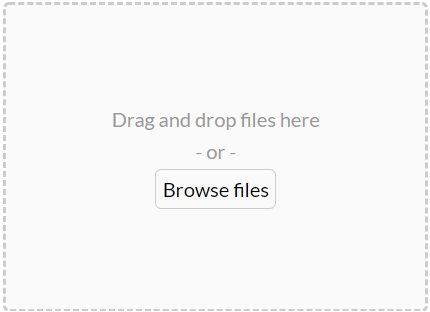
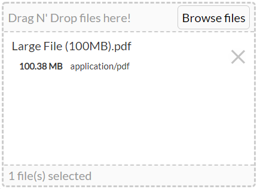

[🠈](../index.md)

# FileDragDrop

Drag and Drop files to upload.

```html
<FileDragDrop v-model="files" />
```

## Properties

| Property          | Type    | Description                                                  | Default |
| ----------------- | ------- | ------------------------------------------------------------ | ------- |
| `v-model`         | array   | The array of files.                                          | `[]`    |
| `accept`          | string  | The accepted file types.                                     | `*`     |
| `multiple`        | boolean | Whether to allow multiple files.                             | `false` |
| `disabled`        | boolean | Whether to disable the component.                            | `false` |
| `prepend`         | boolean | Whether to prepend the files.                                | `false` |
| `alwaysReplace`   | boolean | Whether to always replace the files.                         | `false` |
| `listItems`       | boolean | Whether to display the list of files.                        | `false` |
| `clickToBrowse`   | boolean | Whether to allow clicking the component to browse for files. | `false` |
| `hideBrowse`      | boolean | Whether to hide the browse button.                           | `false` |
| `allowDuplicates` | boolean | Whether to allow duplicate files.                            | `false` |

## Screen Shots



